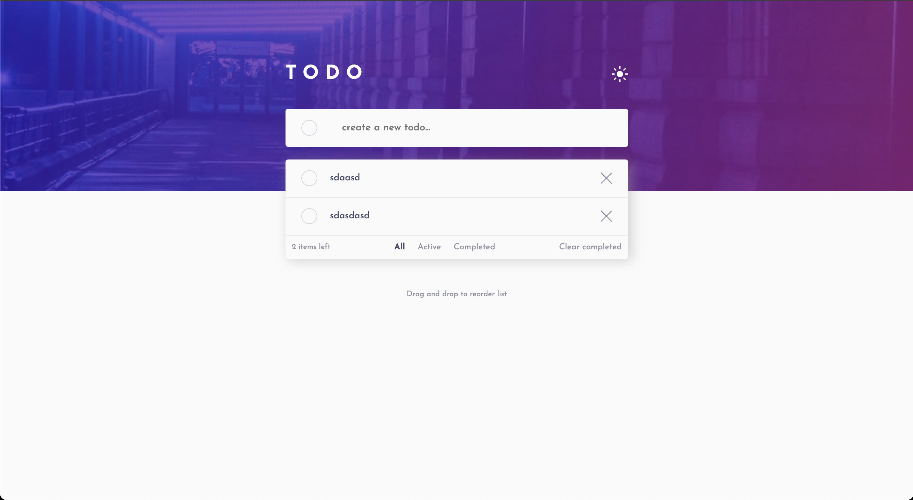

# Frontend Mentor - Todo app solution

This is a solution to the [Todo app challenge on Frontend Mentor](https://www.frontendmentor.io/challenges/todo-app-Su1_KokOW). Frontend Mentor challenges help you improve your coding skills by building realistic projects.

## Table of contents

- [Overview](#overview)
    - [The challenge](#the-challenge)
    - [Screenshot](#screenshot)
    - [Links](#links)
- [My process](#my-process)
    - [Built with](#built-with)
    - [What I learned](#what-i-learned)
    - [Continued development](#continued-development)
    - [Useful resources](#useful-resources)
- [Author](#author)

## Overview

### The challenge

Users should be able to:

- View the optimal layout for the app depending on their device's screen size
- See hover states for all interactive elements on the page
- Add new todos to the list
- Mark todos as complete
- Delete todos from the list
- Filter by all/active/complete todos
- Clear all completed todos
- Toggle light and dark mode
- **Bonus**: Drag and drop to reorder items on the list

### Screenshot



### Links

- Solution URL: [Solution URL](https://github.com/amjadsh97/todo-main-app)
- Live Site URL: [Live site](https://todo-main-app-psi.vercel.app/)

## My process

### Built with

- Semantic HTML5 markup
- CSS custom properties
- Flexbox
- [React](https://reactjs.org/) - JS library

### What I learned

* CRUD for Todo app:
  I gained experience in developing the Create, Read, Update, and Delete (CRUD) functionality for a Todo application, enabling users to interact with the platform seamlessly.

* Re-order list by drag and drop:
  I learned how to enhance user experience by enabling drag-and-drop functionality, allowing users to easily reorder items in the list to their preference.

* dark mode:
  I implemented a dark mode feature to improve accessibility and cater to users' preferences, ensuring a more comfortable viewing experience in low-light environments.

#### Javascript code
```js
 const handleDragStart = (e: React.DragEvent<HTMLElement>, index: number) => {
	e.dataTransfer.setData('index', index.toString());
};

const handleDragOver = (e: React.DragEvent<HTMLElement>) => {
	e.preventDefault();
};

const handleDrop = (e: React.DragEvent<HTMLElement>, targetIndex: number) => {
	e.preventDefault();
	const startIndex = parseInt(e.dataTransfer.getData('index'));
	const draggedTodo = todos[startIndex];
	const updatedTodos = [...todos];
	updatedTodos.splice(startIndex, 1);
	updatedTodos.splice(targetIndex, 0, draggedTodo);
	setTodos(updatedTodos);
};
const handleDragLeave = (): void => {
	setIsDraggingOver(false);
};
```


### Continued development

In the future, I will prioritize further developing my skills in make authentication system and integrate the app with backend.


### Useful resources

- [React Docs](https://react.dev/) - This helped me for building react components. I really liked using this docs.

## Author

- Website - [Amjad Shadid](https://amjadshadid.vercel.app/)
- Frontend Mentor - [@amjadsh97](https://www.frontendmentor.io/profile/amjadsh97)
- Twitter - [@Amjadshadid](https://twitter.com/Amjadshadid)
- Linkedin - [@Amjad Shadid](https://www.linkedin.com/in/amjad-shadid-134355134/)